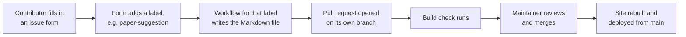

# Maintaining the reading list

This guide is for the people who review contributions and keep the site running. If you want to _contribute_ something to the reading list, see [`CONTRIBUTING.md`](CONTRIBUTING.md) instead.

Most of the work is reviewing pull requests. Contributors suggest notes through GitHub issue forms, and GitHub Actions turns each suggestion into a pull request for you to review.

## How a suggestion becomes a page



Each issue form applies a label, and each label triggers a workflow:

| Issue form | Label | Workflow | PR branch |
|---|---|---|---|
| Suggest literature: paper | `paper-suggestion` | `suggest-paper-to-pr.yml` | `add-suggested-paper-<issue>` |
| Suggest literature: textbook | `textbook-suggestion` | `suggest-textbook-to-pr.yml` | `add-suggested-textbook-<issue>` |
| Suggest literature: lecture notes or slides | `lecture-notes-suggestion` | `suggest-lecture-notes-to-pr.yml` | `add-suggested-lecture-notes-<issue>` |
| Suggest tutorial | `tutorial-suggestion` | `suggest-tutorial-to-pr.yml` | `add-suggested-tutorial-<issue>` |
| Edit existing literature entry | `edit-literature` | `edit-page-to-pr.yml` | `edit-page-<issue>` |
| Edit existing tutorial | `edit-tutorial` | `edit-page-to-pr.yml` | `edit-page-<issue>` |

The three literature workflows share their steps through `_suggest-literature-to-pr.yml`. The issue forms live in `.github/ISSUE_TEMPLATE/` and the workflows in `.github/workflows/`.

The PR closes its issue when it's merged.

### Things that silently break the pipeline

These have both caught us out before, and neither produces an obvious error:

- **The labels must exist in the repository.** An issue form can only apply a label that already exists; otherwise it's dropped silently and no workflow runs. If you add a form or rename a label, create the label first (**Issues** → **Labels**, or `gh label create <name>`).
- **Workflows must ask for write permissions explicitly.** The repository's default token is read-only. Any workflow that pushes a branch or opens a PR needs a `permissions:` block with `contents: write` and `pull-requests: write`. For workflows that call `_suggest-literature-to-pr.yml`, that block must be on the _calling_ job. Without it the run fails immediately with `startup_failure`, before any step runs.

Check **Actions** now and then for failed runs, especially after changing a workflow.

### When a suggestion didn't produce a PR

Look at the issue's labels, then at the matching run in **Actions**.

- **Suggestions** (paper, textbook, lecture notes, tutorial) run again whenever the issue is edited. They skip the issue if its PR branch already exists.
  - **No PR yet:** fix the problem (e.g. add the missing label), then make any small edit to the issue body.
  - **A PR exists but is wrong:** usually it's quickest to fix the PR directly (see below). To regenerate it instead, close the PR, delete its branch, then edit the issue.
- **Edits** only run when the issue is first opened, so editing the issue does nothing. Use **Re-run jobs** on the failed run in **Actions**, or ask the contributor to open a new edit from the page's ✏️ button.

An edit also fails if the issue title doesn't start with `Edit: docs/...`. That happens when someone opens the edit form from the template list instead of the ✏️ button on the page.

## Reviewing a pull request

Every PR needs **one approving review** and a passing **build** check before it can be merged into `main`.

The **build** check (`build.yml`) builds the whole site, so a red check usually means broken frontmatter or Markdown. Open the check's log to see which page failed.

### Checklist

- [ ] **Location:** the file is in a sensible folder under `docs/literature/` or `docs/tutorials/`, with consistent capitalisation (e.g. `materials/structural/`, not `Materials/Structural/`).
- [ ] **Filename:** literature notes follow the [filename convention](CONTRIBUTING.md#filename-convention-for-literature-notes), e.g. `howes2006astro-gyrokinetics.md`.
- [ ] **Tags:** reuse existing tags where possible and follow the [tag conventions](CONTRIBUTING.md#choosing-tags). The Tags page on the site lists every tag in use.
- [ ] **Frontmatter:** for papers, the DOI is correct (the title, authors and journal shown on the page come from it). For textbooks and lecture notes, check the title, authors and links.
- [ ] **No copyrighted files:** contributors sometimes attach PDFs of papers to the issue. Don't add these to the repository; link to the DOI or the publisher instead.
- [ ] **Content:** reads sensibly, links work, and maths renders.
- [ ] **Renders correctly:** for anything beyond a small text change, preview it locally (below).

### Making changes to a PR

If something small needs fixing, it's usually quicker to fix it yourself than to ask the contributor:

- **In the browser:** open the PR's *Files changed* tab, then *Edit file* from the file's `…` menu. Moving or renaming a file is easiest by editing its path at the top of the editor.
- **Locally:** check out the branch (below), make the change, commit and push.

### Previewing a PR locally

You need [`uv`](https://docs.astral.sh/uv/) and the [GitHub CLI](https://cli.github.com/).

```sh
gh pr checkout <PR number>
uv sync --locked
uv run zensical serve
```

Then open http://localhost:8000. Comments only load on `localhost:8000` and the live site (see [Comments](#comments)).

## How the site is built

The site is built with [Zensical](https://zensical.org/) and deployed to GitHub Pages by `build.yml` on every push to `main`. It's configured in `zensical.toml`.

### Custom Markdown extensions

Three Python-Markdown extensions in `scripts/` add the parts of each page that come from its frontmatter:

| Script | What it does |
|---|---|
| `doi_reference.py` | For pages with a `doi`, fetches the title, authors and journal from Crossref (or DataCite for arXiv) and adds a reference header. This needs internet access at build time. If a lookup fails, the page is built without the header. |
| `title_reference.py` | For pages with a `title` but no `doi` (textbooks, lecture notes), adds a header with the authors, ISBN, availability and links. |
| `contributors.py` | Adds the "Contributed by" line from `contributors`. |

They're enabled in `zensical.toml` under `[project.markdown_extensions]`. They're also listed under `[tool.hatch.build.targets.wheel]` in `pyproject.toml`, which is how they're installed so Zensical can find them. A new extension needs adding in both places.

### Theme overrides

Files in `overrides/` replace parts of the Zensical theme:

- `partials/actions.html`: the ✏️ edit button. It links to the edit issue form, with the page's path in the title. `docs/javascripts/edit-button.js` pre-fills the form with the page's current text.
- `partials/comments.html`: the comments section (see below).

### Comments

Comments at the bottom of each page use [giscus](https://giscus.app/), which stores them as GitHub Discussions in the *Content discussion* category. Pages are matched to discussions by URL path. **Renaming or moving a page detaches it from its existing comments**, so avoid moving pages once people have commented on them.

`giscus.json` lists the sites allowed to show comments: the live site and `localhost:8000`.

## Upgrading Zensical

`uv.lock` pins the exact version of Zensical (and everything else). The site only changes when someone updates it, so upgrades happen through a PR:

```sh
uv lock --upgrade-package zensical
uv sync --locked
uv run zensical build --clean
```

Then:

1. Read the [release notes](https://github.com/zensical/zensical/releases) for every version you're skipping. Zensical is pre-1.0, so things can change between versions.
2. Run `uv run zensical serve` and compare a few page types against the live site: a paper (DOI header), a textbook, a tutorial with maths, and the home page.
3. Open a PR with the updated `uv.lock`, and say which versions it moves between.

For example, the upgrade from 0.0.21 to 0.0.68 started reading frontmatter as YAML 1.2. An unquoted ISBN with leading zeroes (0070428077) lost its zeros, and only a visual comparison caught it.

## Repository settings

These live in GitHub's *Settings*, not in the repository's files, so they're listed here:

- **Branch protection on `main`:** pull requests need one approving review and a passing `build` check.
- **Actions → General → Workflow permissions:** read-only by default (see [above](#things-that-silently-break-the-pipeline)).
- **Pages:** deployed from GitHub Actions.
- **Discussions:** enabled, with a *Content discussion* category for giscus.

## Handing over

Maintainers are PhD students, so the team changes every year or two. Before you leave:

- [ ] Make sure at least two people who are staying have **admin** access (*Settings → Collaborators and teams*).
- [ ] Remove or downgrade your own access if you won't be maintaining any more.
- [ ] Tell the new maintainers about this file.
