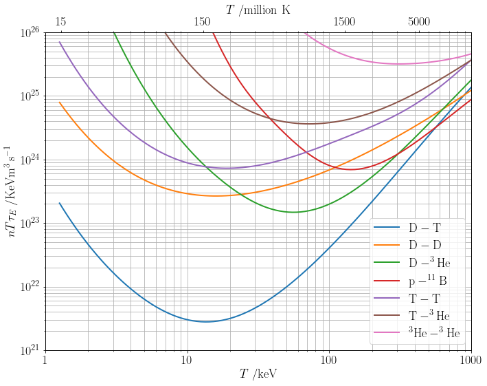

---
tags:
  - Fusion reactions
  - Triple product
  - Nuclear data
  - Python
  - MCF
  - ICF
contributors:
  - name: "Felix Watts"
    github: "FelixWattsYork"
comments: true
---

# Fusion cross-section and reactivity plots

Resources for making good-looking plots of fusion cross sections and reactivities from evaluated nuclear data, and of quantities derived from them. For example, the plot below shows the triple product $nT\tau_E$ needed for ignition against temperature for seven fusion reactions, which shows why D–T is by far the easiest fuel.

- [**Nuclear fusion cross sections**](https://scipython.com/blog/nuclear-fusion-cross-sections/) (blog post by Christian Hill, scipython.com): plots the cross sections of nine fusion reactions against collision energy, and their Maxwellian-averaged reactivities ⟨σv⟩ against temperature, with Python code that reads the nuclear data, interpolates it with SciPy and integrates over a Maxwell–Boltzmann distribution.
- [**fusion_cross_sections**](https://github.com/shimwell/fusion_cross_sections) (GitHub repository by Jonathan Shimwell): ready-to-run scripts for plotting D–T, D–D and other cross sections, based on the blog post.
